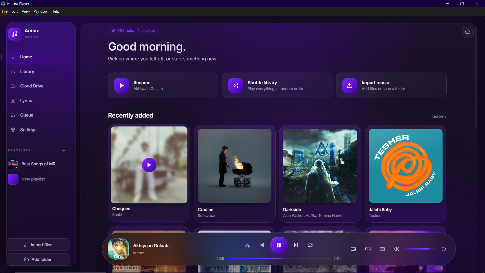
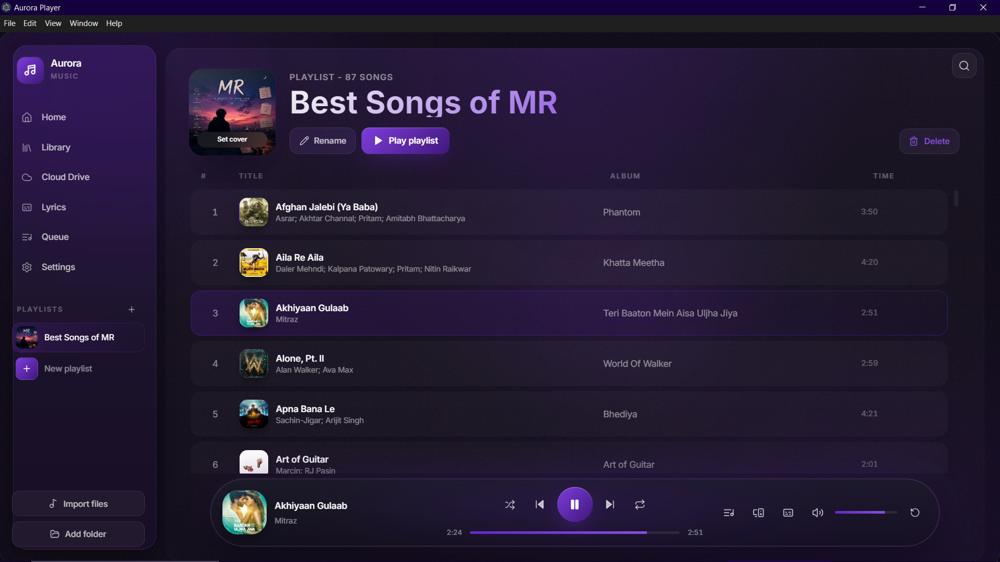
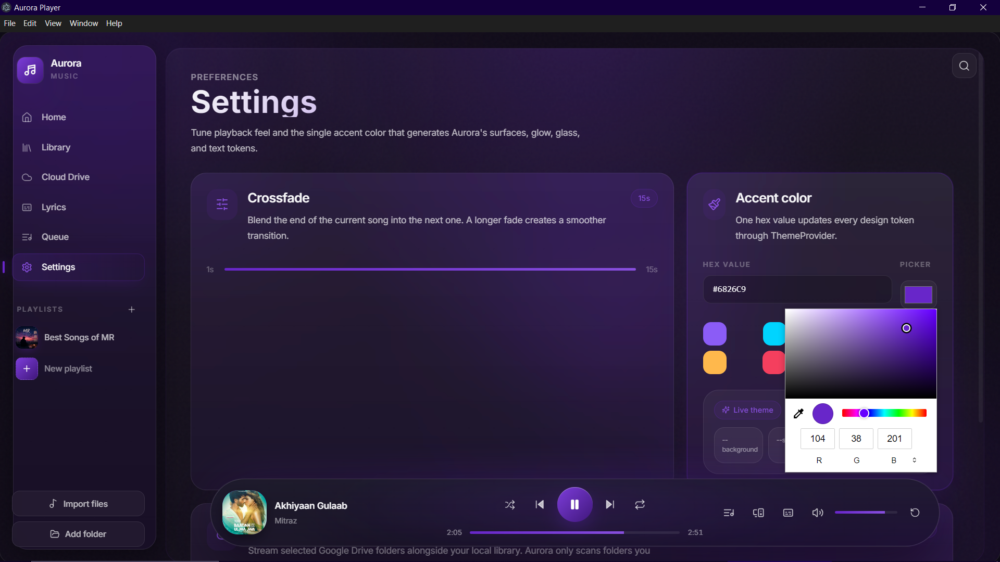
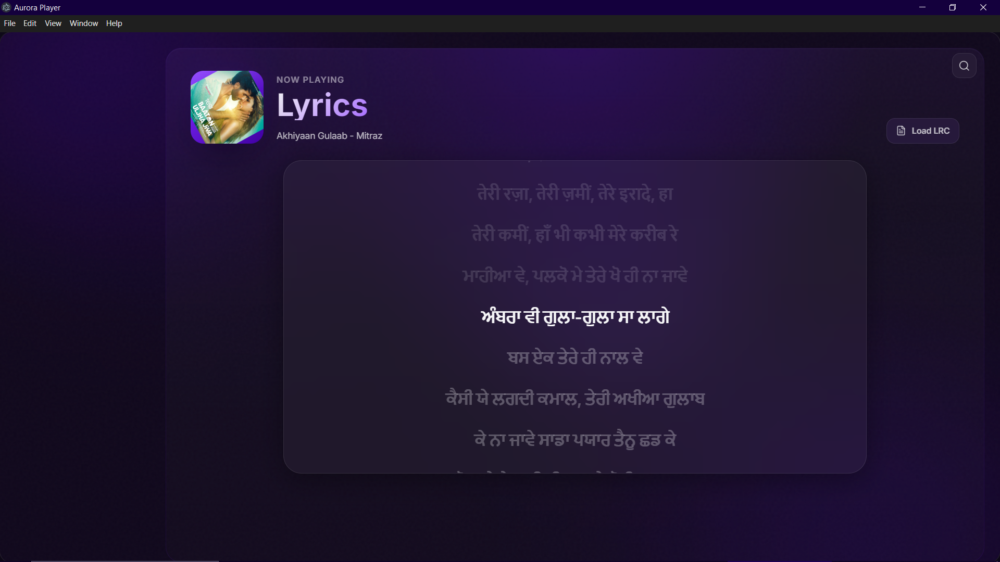

# 🎵 Aurora Player

> A modern, elegant, and feature-rich desktop music player built with Electron, React, TypeScript, and Tailwind CSS.


---

## ✨ Overview

Aurora Player is a premium desktop music player designed for people who own and enjoy their local music library. It combines a modern glassmorphism-inspired interface with high-quality playback and advanced library management.

Unlike streaming-focused players, Aurora is built around your personal music collection, delivering a fast, beautiful, and customizable listening experience.

---

## 🚀 Features

### 🎧 Playback
- High-quality local audio playback
- FLAC support
- MP3 support
- WAV support
- Smooth Crossfade
- Shuffle & Repeat
- Queue Management
- Stream Songs From Drive(Cloud)

### 🎨 Beautiful Interface
- Modern glassmorphism design
- Dynamic color themes
- Album artwork backgrounds
- Floating Now Playing bar
- Responsive desktop layout
- Dark Mode

### 📚 Music Library
- Automatic library scanning
- Artist & Album organization
- Fast search
- Playlist support
- Recently played
- Favorites

### 🖼 Metadata
- Reads embedded FLAC/MP3 metadata
- Embedded album artwork
- Artist & album information
- Cached metadata for faster loading

### 🎤 Lyrics
- Embedded lyrics support
- Online lyrics lookup
- Local lyrics cache
- Synced LRC support

### ⚡ Performance
- Fast startup
- Optimized library loading
- Local artwork cache
- Lightweight architecture

---

## 🛠 Tech Stack

- Electron
- React
- TypeScript
- Tailwind CSS
- Vite
- music-metadata
- Node.js

---

## 📂 Project Structure

```
Aurora Player
│
├── src/
│   ├── components/
│   ├── pages/
│   ├── services/
│   ├── hooks/
│   ├── utils/
│   └── assets/
│
├── electron/
│
├── public/
│
├── cache/
│   ├── artwork/
│   ├── lyrics/
│   └── metadata/
│
└── package.json
```

---

## 📸 Screenshots

### Home


### Playlist


### Settings


### Lyrics


---

## ⚙ Installation

Clone the repository:

```bash
git clone https://github.com/USERNAME/AuroraPlayer.git
```

Go into the project:

```bash
cd AuroraPlayer
```

Install dependencies:

```bash
npm install
```

Run the application:

```bash
npm run dev
```

Build for production:

```bash
npm run build
```

---

## 🗺 Roadmap

- [x] Local Music Playback
- [x] Crossfade
- [x] Playlists
- [x] Metadata Reader
- [x] Embedded Album Art
- [x] Modern UI
- [x] Synced Lyrics
- [x] Cloud Storage
- [ ] Equalizer
- [ ] Audio Visualizer
- [ ] Mini Player
- [ ] Smart Playlists
- [ ] Plugin System
- [ ] Mobile Companion App

---

## 🤝 Contributing

Contributions, bug reports, and feature suggestions are welcome.

Please open an issue before submitting major changes.

---

## 📜 License

This project is licensed under the MIT License.

---

## ❤️ Acknowledgements

Built with:

- Electron
- React
- Tailwind CSS
- TypeScript
- Vite
- music-metadata

---

## 👨‍💻 Author

**Mohammed Rafaz**

Made with ❤️ for music lovers.
This Project not fully developed my me I vibe codded it mostly :/

---

### ⭐ If you like Aurora Player, consider giving this repository a star!
